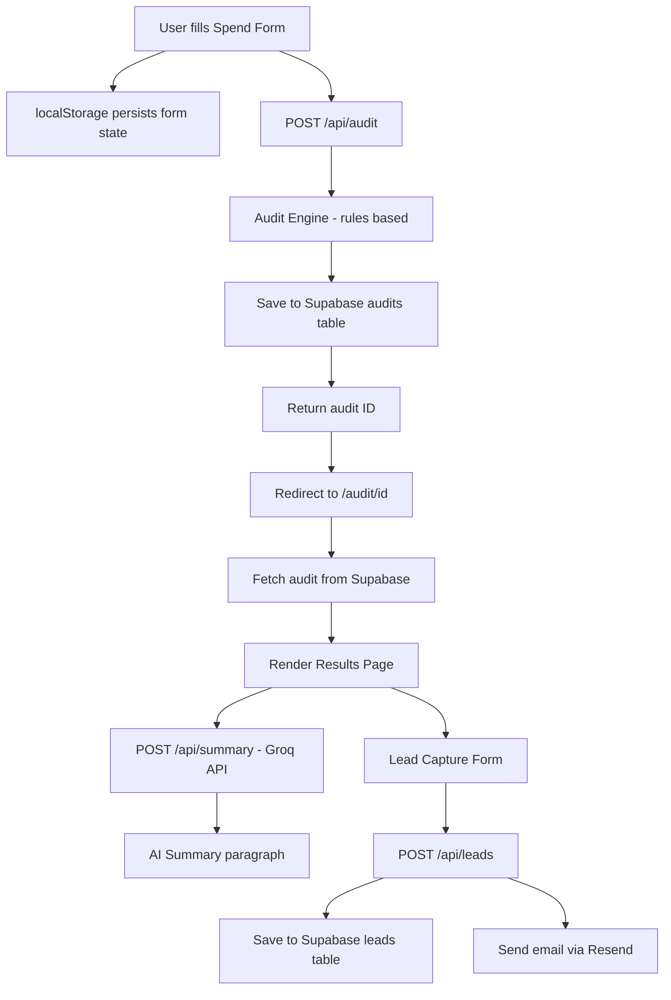

# Architecture

## System Diagram

## Data Flow

1. User inputs tools, plans, spend, seats, team size, use case on the form
2. Form state is saved to localStorage on every change — survives page reloads
3. On submit, POST /api/audit receives the input
4. Audit engine runs rules-based logic — no AI — and returns recommendations
5. Result is saved to Supabase audits table, returning a UUID
6. User is redirected to /audit/[uuid] — this is the shareable URL
7. Page fetches audit data server-side from Supabase
8. Client-side, AuditSummary component calls POST /api/summary with audit data
9. Groq API generates a personalized 100-word summary — falls back to template on failure
10. User submits email via LeadCaptureForm
11. POST /api/leads saves to Supabase leads table and triggers Resend email

## Why This Stack

**Next.js App Router** — Server components for the results page means audit data
is fetched server-side, giving faster load times and proper SEO for shareable URLs.
The form is a client component because it needs localStorage and React state.

**Supabase** — Postgres under the hood with a generous free tier. RLS policies
lock down the tables. SQL is easier to reason about than NoSQL for structured
audit data with relationships between audits and leads.

**Groq** — Significantly faster inference than OpenAI (sub-second vs 2-3 seconds).
The summary is a supporting feature — speed matters more than raw capability.
Falls back gracefully to a templated summary on API failure.

**Resend** — Simple transactional email API with a clean free tier. 3,000 emails/month
is more than enough for an MVP. Postmark and SES were considered but Resend has
the simplest integration for Next.js.

**Vercel** — Zero config deployment for Next.js. Automatic preview deployments
on every push. Free tier covers this scale easily.

## What I Would Change at 10,000 Audits/Day

1. **Cache audit results** — Add Redis (Upstash) to cache frequent audit patterns.
   Most startups use similar tool combinations — no need to recompute identical inputs.

2. **Queue email sending** — Move Resend calls to a background job queue (Inngest or
   Trigger.dev) so the leads API responds instantly instead of waiting for email delivery.

3. **Rate limiting** — Add proper rate limiting with Upstash Redis instead of
   just a honeypot field. Limit by IP — max 10 audits/hour per IP.

4. **Separate the audit engine** — Extract audit logic into a standalone service
   so it can be updated independently without redeploying the whole app.

5. **Analytics** — Add Posthog for funnel tracking. Need to know drop-off between
   audit completed → email submitted → Credex consultation booked.

6. **CDN for results pages** — Add ISR (Incremental Static Regeneration) to
   cache popular audit result pages at the CDN edge for instant loads.